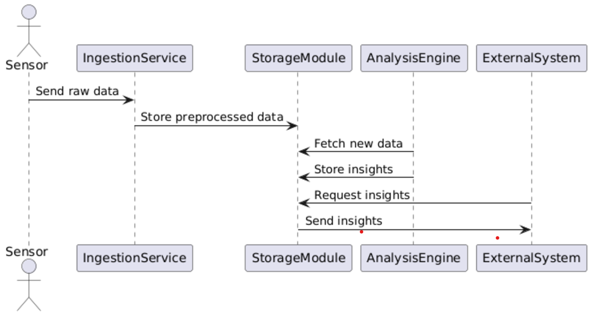
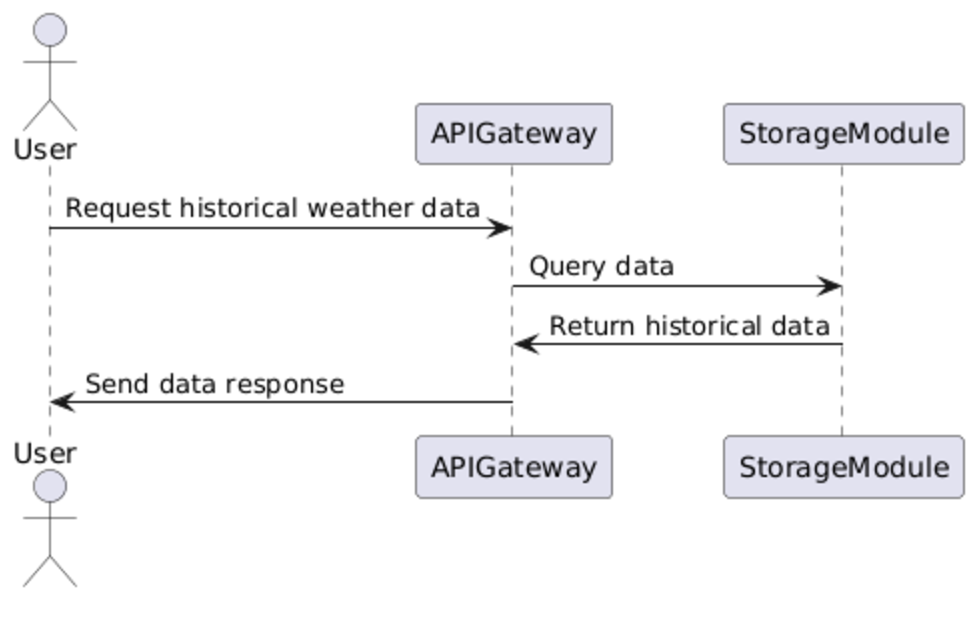
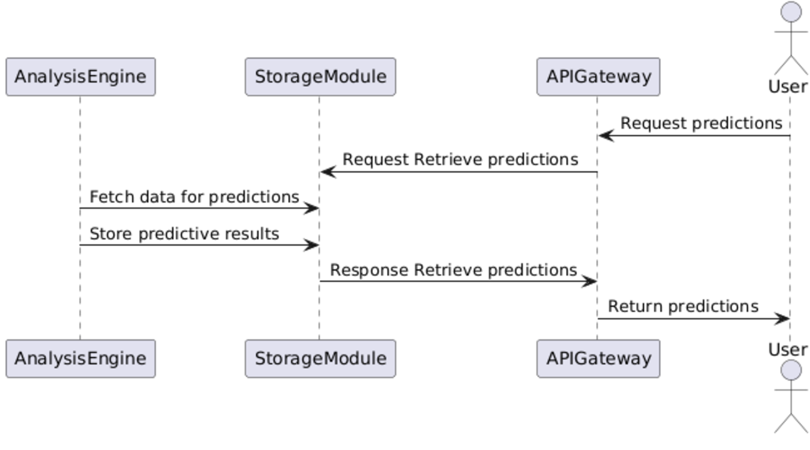
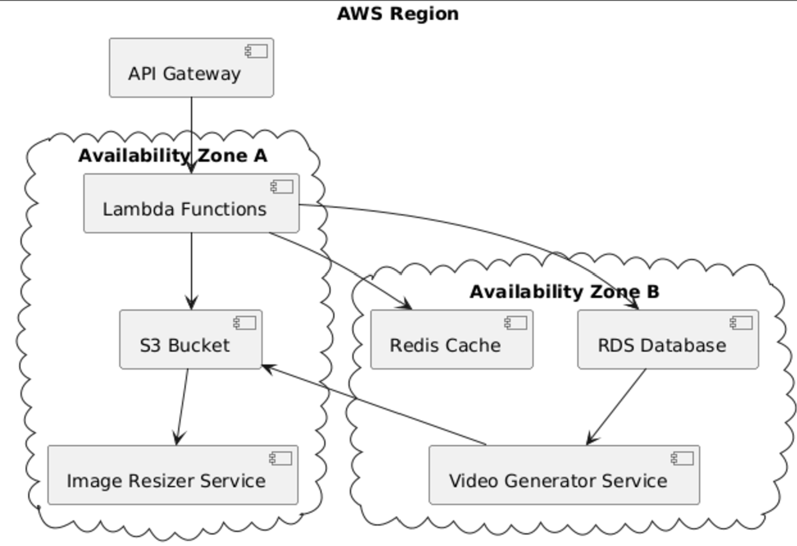
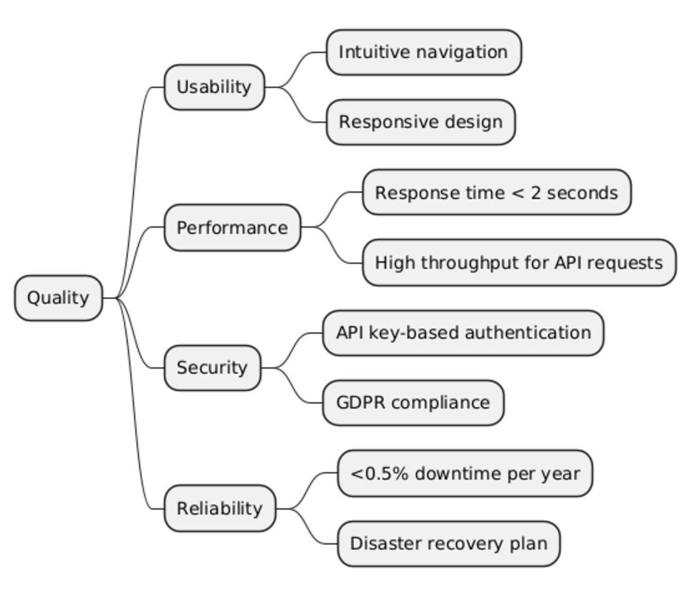

# Introduction and Goals 

This section introduces The Weather Archive and explains underlying goals and requirements, which we pursue in the development of the new Weather Archive web applicaiton. 

### What is The Weather Archive

The Weather Archive is a platform for historical weather data. Having installed multiple cemeras across all european major cities, we want to provide historical weather data freely on the internet.
- Using our own API, we can provide high-resolution visual weather footage
- We pass metadata like humidity, air pressure at certain points in time

## Requirements Overview
Our target is to create a new web application, which displays historical weather data. These cameras take high-resolution pictures every five minutes, and we have to create an applicaiton, which 
- is accessible via browser across the entire world
- can scale with ease
- is reasonably performant in its response time (< 2 seconds)
- has below 0.5 % downtime each year
- is extensible and maintainable
- offers a good usability for website visitors
- use serverless technologies to minimize idle-costs

We aim to provide an application that is up to modern standards in visual as well as technical aspects, but also allows us to start small, and scale up to cover very high traffic loads.

| Id | Requirement | Explanation |
| ------- | ------- | ------- |
| F1 | Use loosely coupled microservices | As we aim to grow and potentially add new functionalities, we have to keep our system modular and extensible. Furthermore, there shall be minimum downtimes, which is why we need to decouple our functionalities as much as possible. |
| F2 | Worlwide availability | Our applicaition needs to be accessible to the biggestmost userbase possible. Anyone requiring european wether cam footage should be able to do, primarily via our web application. |
| F3 | Horizontal scalability | We need to be scalable in times of high demand, but also have to reduce idle costs, which is why we are going to use serverless functions inside our cloud infrstructure. |
| F4 | Response times below three seconds | Our weather cams provide high-resolution footage. Furthermore, we need to process video material to provide moving imagery, and we are going to use serverless functions to avoid idle costs. Still, our response times need to as low as possible. | 
| F4 | Visual usability assistance | Our users should be guided through the use of our web app. Thus, we have to keep to UX standards and aid them by useful features along their visits. | 
| F5 | Event-driven architecture | A lot of our backend processing can take place asynchronously, so we are able to reap the benefits of event-driven architectures. | 

## Quality Goals
The following table explains our three most important quality goals

| Id | Quality Goal | Explanation |
| ------- | ------- | ------- |
| QG1 | Maintainability | Our system may need to be modified in the future, so adding, modifying or improving system components based on changes in environemt or requirements needs to be easily doable. |
| QG2 | Reliability | Our system can handle a strongly varying number of traffic from across the globe. Errors within our system do not lead to total system outages, but rather only to outages of small system components. |
| QG3 | Operability | The system can be understood, learned, used and is attractive to our users. |

## Stakeholders
There are plenty of stakeholders, which hold some special interest in our system. The following section lists our main stakeholders and puts there interests in relation.

| Who | Interests |
| ------- | ------- |
| Software Architects | Require good understanding of software architecure, underlying thoughts and requirements as well as stakeholders. |
| Software Developers | Require an understanding of our system's software components and the overall system architecture. Are in need of a secure and modular environment, that makes adapting the sytem straightforward. |
| End users | Need ease of use when accessing our web application. The do not want to spend time learning how to achieve their desired task. Also, they want speedy performance, so as little loading time as possible. |
| DevOps Team | Want to have parts of the development process automated, in order to save time and improve efficiency. Want the software architecture to be modular and finegrained, in order to split up developers into smaller teams. They love the cloud. |
| Requirements Engineers | Need understanding of all stakeholders. Need clear documentations and require an understanding of system boundaries. |
| Meteorological Agencies | Want access to our data, in order to potentially use it for their own services. |

# Architecture Constraints
In order to achieve our quality goals and fulfill requirements, there are certain aspects that limit our freedom. These architectural constraints a listed below.

| Topic | Constraint |
|-----|------|
| Cloud Infrastructure | We need to use the cloud, which makes us prone to vendor lock-in. |
| High resolution imagery | As our images are very high resolution, we might need to vertically scale up, or downsize our instances, in order to quickly process these files. |
| Serverless functions | These functions can slow down our entire application, as they are required to cold-start frequently. |
| Data storage in serverless environments | We cannot store data well when working with serverless functions, as they are stateless, so we have to find a workaround for that. |
| Provider limitations | All limitations for concurrency, and lifetime configurations are limited to some degree by cloud providers, so we have to adhere to their limitations. |
| Costs | We can only afford so much infrastrucutre, so we have to make sure we do not exceed our budget when using auto-scaling features adn the like. |
| Data consistency | If we use caching mechanisms for performance benefits, we might suffer constraints regarding data consistency, so we have to take this into consideration. | 
| Data Privacy | Occasionally, there will be people walking around in our camera footage. We might have to take additional measures in order to blur faces, license plates and more. Also we have to consider which data will eventually end up in the cloud, and which GDPR / HIIPA constraints we therefore need to consider. |

# Context and Scope

The main players of our system are the system itself, which has an interface to its users on the one hand, and an interface to the weather cams on the other hand. Weather cams also receive information from our telemtetric sensors, so that we can add metadata about air pressure and such to our files. Also, system administrators have a special interface to our system, as they need to have priviledged access.

## Business Context
The diagram shows the main interfaces between our system and outside actors, such as users, admins and our weather cams, which are physically distributed across Europe. 

## Technical Context
In terms of technical interfaces, there are plenty of interfaces within our system. Users and Webcams all require the API, in order to reach the sysems internal functionalities. Our microservices, serverless functions, as well as our databases will have an interface to our API and event system.

# Solution Strategy
To fulfill the requirements and achieve the outlined quality goals, the following solution strategy will be implemented:

## Architectural Solution Strategy
The following solution strategies are applied in regards to our architectural challenges. 

| Topic | Solution Strategy |
|-----|------|
| Microservices-based Architecture | The system will be designed as a collection of loosely coupled microservices (F1) to enhance modularity and maintainability (QG1). This approach also enables independent scaling and reduces the risk of total system failure (QG2). Each service will have a specific responsibility, such as image processing, metadata management, and user interactions. | 
| Event-driven Architecture | Asynchronous processing of tasks, such as image processing and metadata generation, will be handled via an event-driven architecture (F5). This will improve system performance and ensure scalability (F3). |
| Serverless Computing | Wherever possible, serverless technologies like AWS Lambda will be used to minimize idle costs and enable horizontal scalability (F3). Stateless serverless functions will handle transient, compute-intensive operations, such as image resizing or metadata handling. |

### Data Storage and Processing
The following solution strategies are applied to challenges regarding data persistence. 

| Topic | Solution Strategy |
|-----|------|
| Cloud-native Storage | High-resolution images and video files will be stored in scalable, cloud-native storage services like Amazon S3 or Google Cloud Storage. Metadata and application data will reside in globally distributed databases such as DynamoDB or Firebase Firestore, ensuring low-latency access worldwide (F2). |
| Image Optimization | To meet performance requirements (F4), high-resolution images will be dynamically resized based on the requesting device’s capabilities. This process will be automated using serverless functions and caching layers. |
| **Optional:** Content Delivery Network | A CDN could be used to cache static assets, including weather imagery, and serve them efficiently to end users (F2, F4). This will also reduce load on the backend services and ensure consistent response times under high traffic conditions. |

### Scalability and Performance
The following solution strategies are applied to challenges regarding scalability and performance. 

| Topic | Solution Strategy |
|-----|------|
| Horizontal Scaling | Auto-scaling mechanisms will be employed to handle fluctuating traffic loads, particularly during peak periods (F3). Services will scale independently based on their specific workloads. |
| Cold Start Mitigation | Techniques like keeping serverless functions warm for critical endpoints or pre-compiling dependencies will be implemented to mitigate latency caused by cold starts. |

### Usability and Design
The following solution strategies are applied to challenges regarding usability and design. 

| Topic | Solution Strategy |
|-----|------|
| Intuitive User Interface | The web application will adhere to modern UX/UI standards (F4). Features like search functionality and guided user flows will ensure a seamless experience for end users (QG3). |

### Maintainability and Extensibility
The following solution strategies are applied to challenges regarding maintainability and extensibility. 

| Topic | Solution Strategy |
|-----|------|
| API-driven Design | The system will expose functionalities via RESTful APIs to support easy integration with external services and future extensions (F1, QG1). |
| Modular Codebase | By adhering to best practices in modular software design, the system will allow developers to add or modify components with minimal disruption (QG1). |

# Building Block View
In this sectioon, we will give insights to layers of our syetem, each getting more and more detailed. 

## Whitebox Overall

The following sdiagram shows the Top-Level View of our system. Further down, we will go into more detail on the lower level implementations of some building blocks. 

The reasons we decided to split our system that way are explained in the above sections. Driving considerations and goals are maintainability, extensibility as well as reliability. 

### BB1: The Weather Archive

# Runtime View

## Runtime Scenario 1: Real-Time Weather Processing

Description:

The Data Ingestion Service collects data from sensors and external APIs.
Preprocessed data is sent to the Data Storage Module.
The Data Analysis Engine fetches new data and updates insights.
External systems request insights via the API Gateway.

## Runtime Scenario 2: Data Retrieval for Historical Analysis 

Description:

1. External systems request historical weather data via the API Gateway.

2. The API Gateway queries the Data Storage Module for relevant data.

3. The requested data is formatted and sent to the external system.

## Runtime Scenario 3: Predictive Analysis Execution 

Description:
1. The Data Analysis Engine triggers predictive models based on new data.

2. Results are stored in the Data Storage Module.

3. The API Gateway provides the predictions to external systems upon reques

# Deployment View
| Scenario | CAP* | Reasoning | Document Support| 
|----------|----------|----------|----------|
| Real-Time Data Ingestion    | CP   | Consistency: Immediate and accurate data updates are critical to prevent inaccuracies.   | "Ensure real-time updates to system," as per stakeholder feedback.|
| Historical Data Retrieval | AP   | Availability: Users must access historical data without interruptions, even during high demand.  | "Facilitate seamless user experience for data retrieval," per business objectives.|
| Predictive Analysis   | AP   | Partition Tolerance: Handling network partitions ensures continuity in predictive computation.  |"Enable data-driven predictions," from project requirements document.|
| Image Resizing and Video Creation  | AP   | Availability: High priority for seamless content generation to meet operational timelines.  | "Optimize multimedia processing pipeline," based on engineering feedback. |

## Infrastructure Level 1

| Node / Artifact | Description |
|----------|----------|
| API Gateway | Entry point for all external requests, handles routing, security, and throttling. |
| Lambda Functions | Stateless serverless functions executing core application logic. |
| S3 Bucket | Scalable storage for high-resolution weather images and generated videos. |
| RDS Database | Relational database for storing metadata and processed analytical results. |
| Redis Cache | Distributed caching layer to reduce latency for frequently accessed data. | 
| Image Resizer Service | Processes and compresses raw images into web-optimized formats. |
| Video Generator Service | Creates videos from sequential images, ensuring efficient multimedia handling. |
| Cloud Infrastructure (AWS) | Underlying backbone providing scalability, reliability, and distributed availability zones. |

### Motivation:

This deployment ensures scalability and minimizes downtime by leveraging AWS’s multi-AZ architecture. It also optimizes costs by using serverless technologies where applicable.

### Quality and/or Performance Features:

High availability through multi-AZ deployments.

Low latency access to data via distributed caching.

Auto-scaling for Lambda functions to handle variable workloads.

### Mapping of Building Blocks to Infrastructure:

API Gateway: Entry point for all requests.

Lambda Functions: Execute application logic.

S3 Bucket: Store high-resolution weather images.

RDS Database: Store metadata and processed data.

Redis Cache: Cache frequently accessed data.

Image Resizer Service: Resizes images to reduce storage costs and improve performance.

Video Generator Service: Generates video from images stored in

# Cross-cutting Concepts

## Continuous Integration (CI)

A development concept that cuts across various stages of the software development lifecycle.

- Frequent integration of code changes into a shared repository, where automated build and testing processes are triggered.

- Ensures that changes made by different developers do not conflict and helps identify and resolve integration issues early in the development process.

- CI promotes collaboration, reduces integration problems, and contributes to the overall stability of the application.

## Aspect-Oriented Programming (AOP)

Addresses concerns, such as logging or security, which often span multiple modules or layers.

- Allows developers to modularize and encapsulate these cross-cutting concerns separately from the primary business logic.

- Promotes cleaner and more maintainable architecture.

## Role-Based Access Control (RBAC)

Managing access permissions based on roles assigned to users within a system.

- Cuts across different modules and functionalities, ensuring that users only have access to the resources and actions relevant to their roles.

- Enhances security by restricting unauthorized access and helps maintain a clear and scalable security model.

- Influences the design and implementation of security measures throughout the entire application, impacting various components and user interactions.

## Event-Driven Architecture

An architecture pattern promoting loose coupling and asynchronous processing.

- Used to decouple components and enable them to communicate via events.

- Improves scalability by allowing independent scaling of services.

- Supports fault tolerance through retries and compensating actions for failed processes.

## Monitoring and Logging

Ensures operational stability and simplifies debugging across the system.

- Implements tools like AWS CloudWatch for tracking API response times, system uptime, and resource utilization.

- Centralized logging provides a single source of truth for troubleshooting and audit trails.

## Data Privacy and Security 

Cross-cutting concerns affecting data handling and compliance.

- Implements GDPR-compliant measures, such as blurring sensitive information (e.g., faces, license plates) in images.

- Encrypts sensitive data in transit and at rest, such as data stored in the S3 Bucket and RDS Database.

- Enforces API keys and token-based authentication for secure system access.

## Disaster Recovery 
Ensures business continuity and minimizes downtime during critical failures.

- Defines automated backup policies for databases and storage systems.

- Includes processes to restore services within agreed Recovery Time Objectives (RTO).

- Implements multi-region replication for critical data to mitigate regional outages.

## Responsive Design 

A UX-focused concept ensuring compatibility across a variety of devices and screen sizes.

- Implements flexible layouts and adaptive components.

- Ensures the application remains functional and visually appealing across desktops, tablets, and mobile devices.

# Architecture Decisions 

## Serverless Architecture for Compute-Intensive Tasks 

**Objective:** Optimize compute tasks for scalability, cost-efficiency, and fault tolerance.

**Decisions:**

- Adopt AWS Lambda for handling compute-intensive tasks in a stateless manner.

- Leverage serverless architecture to minimize idle costs and simplify scaling.

- Implement cloud-based event triggers to orchestrate workflows across services.

**Advantages:**

- Reduced infrastructure management due to AWS-managed resources.

- Automatic scaling to handle variable workloads without manual intervention.

- Cost-effective for intermittent compute tasks.

**Disadvantages:**

- Cold start latencies might impact performance for critical tasks.

- Limited control over underlying infrastructure.

**Status:** Approved

**Consequence:** Requires careful management of state through external storage solutions such as S3 and DynamoDB.

## Cloud Platform: AWS 

**Objective:** Ensure a scalable, reliable, and globally distributed platform for the application.

**Decisions:**

- Deploy the system using AWS services including S3, RDS, Lambda, and API Gateway.

- Utilize multi-region deployments for critical services to enhance availability.

**Advantages:**

- Broad range of integrated services simplifies implementation.

- Proven reliability and scalability of AWS infrastructure.

- Access to global data centers ensures low latency for users worldwide.

**Disadvantages:**

- Vendor lock-in due to heavy reliance on AWS-specific services.

- Requires expertise in AWS tooling for efficient operation.

**Status:** Approved

**Consequence:** Development and operations must account for AWS-specific limitations and opportunities, such as egress costs and service quotas.

## API Gateway for Communication 

**Objective:** Centralize external communication to simplify request routing and improve security.

**Decisions:**

- Use AWS API Gateway as the entry point for all API interactions.

- Integrate authentication mechanisms directly into the API Gateway.

**Advantages:**

- Unified interface for managing all API requests.

- Built-in support for rate limiting, monitoring, and security policies.

**Disadvantages:**

- Adds slight latency overhead due to request processing layers.

- Potentially complex configuration for managing diverse endpoints.

**Status:** Approved

**Consequence:** Efficient handling of high request volumes, but requires robust backend integration to ensure consistent performance.

## Data Privacy Measures

**Objective:** Ensure compliance with GDPR and other privacy regulations while maintaining data security.

**Decisions:**

- Blur sensitive information (e.g., faces, license plates) in webcam images before storage.

- Encrypt all sensitive data in transit and at rest.

- Use token-based authentication and API keys for secure access.

**Advantages:**

- Protects sensitive user data from unauthorized access or breaches.

- Ensures compliance with legal requirements for data privacy.

**Disadvantages:**

- Increases processing overhead for data anonymization.

- Requires robust key management for encrypted data.

**Status:** In Progress

**Consequence:** Additional computational overhead, but mitigates risks of non-compliance and enhances user trust.

# Quality Requirements

## Quality Scenarios

<!--  -->

# Quality Scenarios and Risks

### Data Security and Privacy

| Goal            | Scenario                                           | Source              | Stimulus                        | Response                                                   |
|-----------------|---------------------------------------------------|---------------------|---------------------------------|------------------------------------------------------------|
| Confidentiality | Only authorized users can view sensitive data.    | Security Assessment | Unauthorized access attempt     | Deny access, log the incident, and alert the admin team.   |
| Integrity       | Prevent tampering with metadata or processed data.| Compliance Audit    | Detect metadata discrepancy     | Log changes, validate the database, and initiate recovery. |
| Authenticity    | Enforce multi-factor authentication for logins.   | Security Requirements | Unauthorized login attempt     | Block access and prompt the user for verification.         |

### Usability

| Goal            | Scenario                                              | Source              | Stimulus                         | Response                                                   |
|-----------------|------------------------------------------------------|---------------------|----------------------------------|------------------------------------------------------------|
| Operability     | New users access weather data intuitively.            | User Feedback       | User reports onboarding issues   | Refine interface design for easier navigation.             |
| Accessibility   | Visually impaired users navigate the application.     | Accessibility Testing | Screen reader compatibility issues | Update UI to meet WCAG compliance standards.               |
| Error Prevention| Prevent user errors during form submissions.          | User Analytics      | User enters invalid data         | Display validation messages and prevent form submission.   |

### Reliability

| Goal            | Scenario                                              | Source              | Stimulus                         | Response                                                   |
|-----------------|------------------------------------------------------|---------------------|----------------------------------|------------------------------------------------------------|
| Availability    | System handles peak traffic efficiently.              | Performance Monitoring | API traffic spike              | Scale serverless functions automatically to handle demand. |
| Fault Tolerance | System reroutes traffic during server failures.       | System Health Checks | Server failure detected         | Redirect traffic to backup regions and log the incident.   |
| Recoverability  | Restore operations after an outage while preserving data integrity. | Disaster Recovery Testing | Simulated outage             | Execute recovery processes and validate data integrity.    |

### Performance

| Goal            | Scenario                                              | Source              | Stimulus                         | Response                                                   |
|-----------------|------------------------------------------------------|---------------------|----------------------------------|------------------------------------------------------------|
| Response Time   | System responds to user requests within 2 seconds.   | Performance Testing | High volume of concurrent requests | Optimize database queries and cache frequently accessed data. |
| Scalability     | Application scales seamlessly during traffic spikes. | Load Testing        | Sudden increase in API traffic   | Automatically provision additional resources using AWS auto-scaling. |
| Throughput      | Handle 1,000+ requests per second during peak hours. | System Benchmarking | Simulated high-load scenario      | Implement efficient load balancing and optimize backend services. |

---

# Risks and Technical Debts

| Risk                                   | Impact              | Mitigation Strategy                                                  |
|---------------------------------------|---------------------|----------------------------------------------------------------------|
| Vendor lock-in with AWS                | Medium              | Abstract core components to reduce dependency on AWS-specific tools. |
| Cold starts in serverless architecture | High                | Pre-warm critical Lambda functions and optimize their dependencies.  |
| Data consistency in distributed caches | High                | Implement robust cache invalidation and fallback mechanisms.         |
| Downtime due to regional AWS outages   | Medium              | Use multi-region replication for critical services.                  |
| Privacy non-compliance                 | High                | Automate GDPR compliance checks and enforce security policies.       |

---

# Glossary

| Term                   | Definition                                                                                                            |
|-----------------------|---------------------------------------------------------------------------------------------------------------------|
| API Gateway            | A service that acts as the entry point for API requests, managing routing, security, and rate limiting.               |
| Lambda                 | A serverless compute service that runs code in response to events and automatically manages the underlying resources. |
| S3                     | Amazon Simple Storage Service used for storing and retrieving large amounts of data.                                  |
| RDS                    | Relational Database Service, a managed database solution provided by AWS.                                             |
| Redis                  | An in-memory data structure store used as a distributed cache for reducing latency.                                   |
| GDPR                   | General Data Protection Regulation, a legal framework for data protection and privacy in the EU.                      |
| Disaster Recovery Plan | A strategy to restore critical systems and data in the event of a failure or outage.                                  |
| CI/CD                  | Continuous Integration and Continuous Delivery, processes for automating software build, test, and deployment.        |

---

